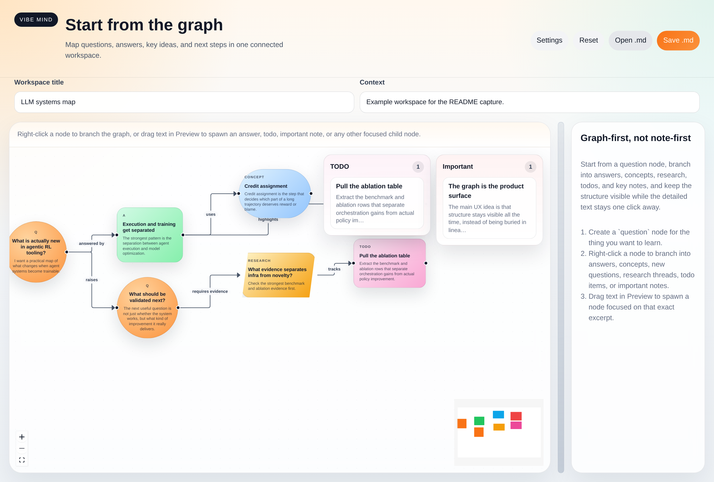

# Vibe Mind

Vibe Mind is a graph-first workspace for learning with AI.

The product starts from the map instead of the document:

- questions, answers, concepts, research notes, todos, and important takeaways live as connected nodes
- each node keeps a markdown body you can read, edit, and reuse
- the whole workspace stays portable as a single markdown file



## Why

When you learn through tools like Codex or Claude, the difficult part is usually not getting one more answer. The difficult part is keeping the structure visible:

- what question started this thread
- which answer resolved it
- which concepts it depends on
- what still needs evidence
- what should be done next
- which points are important enough to keep surfaced

Vibe Mind treats that structure as the primary interface.

## Current Product Shape

- Interactive graph canvas built with `@xyflow/react`
- Typed nodes:
  - `question`
  - `answer`
  - `concept`
  - `research`
  - `todo`
  - `important`
- Right-click any node to create a connected child node
- Select text inside `Preview` to spawn a node from the exact excerpt
- `todo` and `important` are captured directly from selected text or local notes without an LLM round-trip
- Floating `TODO` and `Important` panels stay pinned over the graph for quick review
- Node bodies are editable markdown with live preview
- Autosave to browser local storage
- Import/export as a single markdown workspace file

## Codex Integration

This app uses the local `codex` CLI, not direct API keys.

On this machine, provider status is read from the Codex CLI session plus `~/.codex/config.toml`, so the app can show:

- whether Codex CLI is authenticated
- whether that auth comes from a ChatGPT plan
- the default model
- the configured reasoning effort

Before running the app, confirm:

```bash
codex login status
```

If needed, log in:

```bash
codex login
```

## Run

Detailed setup and run instructions:

- [docs/run.md](./docs/run.md)

```bash
npm install
npm run dev
```

This starts:

- the local Vibe Mind server on `http://localhost:8787`
- the Vite frontend on the local Vite URL, usually `http://localhost:5173`

## Main Flows

### 1. Start from a question

Create or open a `question` node and branch into:

- `answer` for explanation
- `concept` for definition
- `research` for claim verification
- `todo` for next actions
- `important` for key takeaways or warnings

### 2. Right-click a node

The context composer lets you choose a child node type, relation, optional title hint, and body notes.

- `answer`, `question`, `concept`, and `research` use Codex to generate content
- `todo` and `important` are saved directly as captured nodes

### 3. Select text in Preview

Drag across a specific excerpt inside the right-side `Preview` panel.

The selection popover lets you:

- explain the excerpt
- ask the next question
- define a concept from it
- investigate a claim
- save a todo
- mark something important

## Workspace Format

Each workspace is stored as one markdown document.

- graph structure lives in a fenced `vibemind-graph` JSON block
- each node stores typed metadata in a fenced `vibemind-node-meta` JSON block
- node content remains plain markdown

Example:

````md
# Agent Lightning map

Example workspace for understanding Agent Lightning.

```vibemind-graph
{
  "version": 1,
  "viewport": { "x": 0, "y": 0, "zoom": 0.72 },
  "nodes": [{ "id": "agent-lightning-question", "position": { "x": 40, "y": 120 } }],
  "edges": []
}
```

## Node: agent-lightning-question
```vibemind-node-meta
{
  "title": "What is Agent Lightning?",
  "kind": "question",
  "action": "question"
}
```
I want a practical understanding of Agent Lightning.
````

This format is readable without the app and stays git-friendly.

## Validation

```bash
npm run lint
npm run build
```

To serve the built app with the same local Codex-backed server:

```bash
npm run build
npm run serve
```
